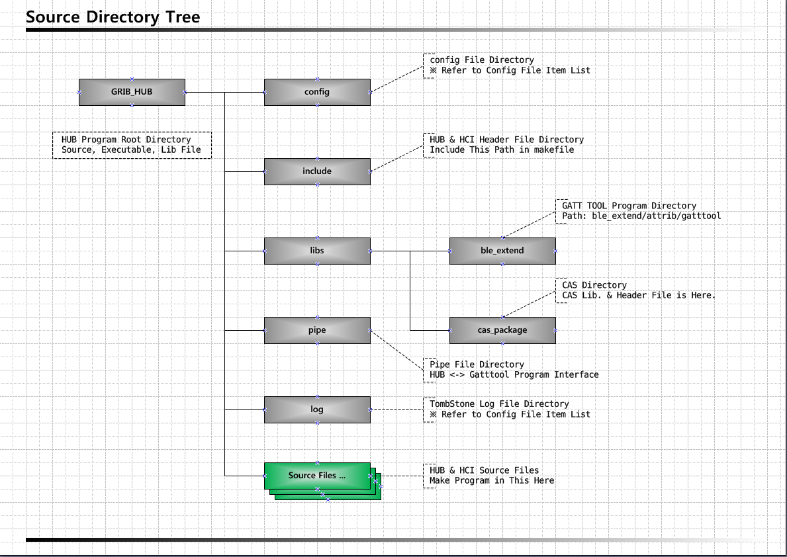

# Build Guide

Gateway를 사용하기 위한 Build 방법등에 대해 설명한다.

## Dependency Lib.
* Common Util Lib.
* Bluetooth Lib.
* MySQL Lib.

#### Dependency Lib. Install Guide
- Common Lib.
Util 성격의 기본적인 Lib를 설치한다. 
Install Command: 
sudo apt-get install libdbus-1-dev 
sudo apt-get install libglib2.0-dev 
sudo apt-get install libdbus-glib-1-dev 
sudo apt-get install libusb-dev 
sudo apt-get install libudev-dev 
sudo apt-get install libreadline-dev 
sudo apt-get install libical-dev 
 

- Bluetooth Lib.
BLE 통신을 위해 BlueZ Lib를 설치한다. 
Install Command: 
wget http://www.kernel.org/pub/linux/bluetooth/bluez-5.4.tar.xz 
tar -xvf bluez-5.4.tar.xz 
./configure --disable-systemd 
make 
※ BlueZ 공식 사이트: [http://www.bluez.org](http://www.bluez.org/) 

- MySQL Lib.
Device의 정보등을 저장하기 위해 MySQL Lib를 설치한다. 
Install Command: 
sudo apt-get install mysql-server 
sudo apt-get install mysql-client 
 
MySQL 설정 파일: 
설정 파일 위치: /etc/mysql/my.cnf 
IP, Port, Memory 등은 사용자에 맞게 설정. 
※ MySQL 공식 사이트: [https://www.mysql.com](https://www.mysql.com/) 

#### Gateway Build Guide
Grib Ble Hub Source를 다운로드 받는다. 
Grib Ble Hub Source는 하기와 같은 구조로 되어있다. 
 
 
Grib Hub Build Command: 
cd “GRIB HUB DIRECTORY” 
make hub_clean 
make hub 
grib_hub 실행파일 생성 
 
Grib HCI Build Command: 
cd “GRIB HUB DIRECTORY” 
make hci_clean 
make hci 
grib_hci 실행파일 생성 
 
