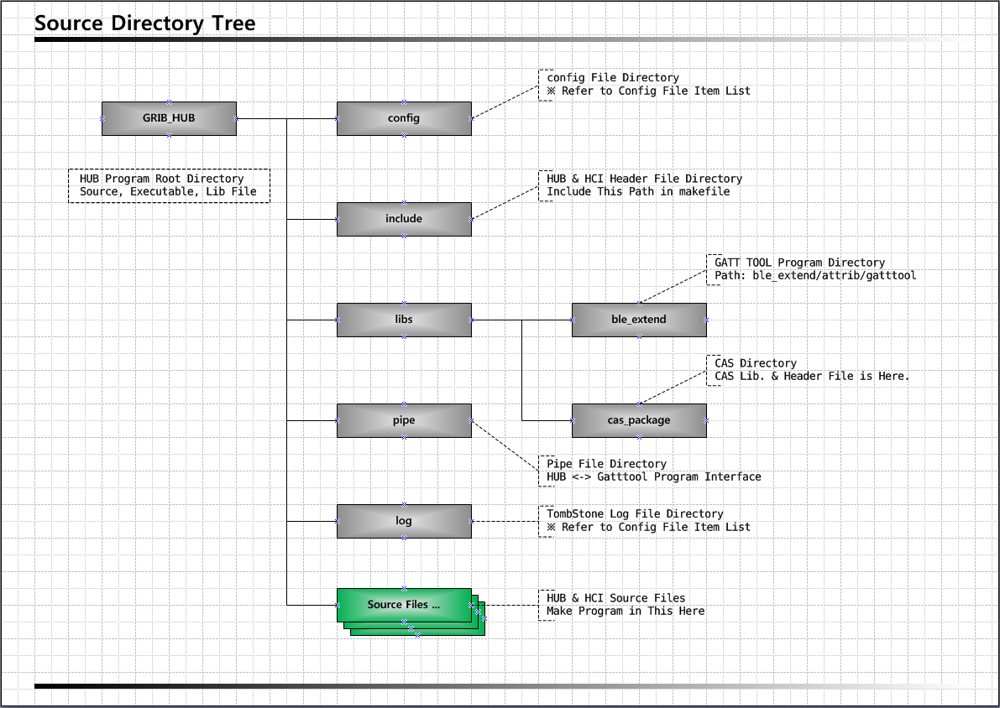

# Build Guide

This guide shows how to build for using a gateway, and so on.

## Dependency Lib.
* Common Util Lib.
* Bluetooth Lib.
* MySQL Lib.

### Dependency Lib. Install Guide
- Common Lib. 
Installs a basic Lib of Util nature. 
Install Command: 
sudo apt-get install libdbus-1-dev 
sudo apt-get install libglib2.0-dev 
sudo apt-get install libdbus-glib-1-dev 
sudo apt-get install libusb-dev 
sudo apt-get install libudev-dev 
sudo apt-get install libreadline-dev 
sudo apt-get install libical-dev 
 

- Bluetooth Lib. 
Install BlueZ Lib for BLE communication. 
Install Command: 
wget http://www.kernel.org/pub/linux/bluetooth/bluez-5.4.tar.xz 
tar -xvf bluez-5.4.tar.xz 
./configure --disable-systemd 
make 
※ BlueZ official site: [http://www.bluez.org](http://www.bluez.org/) 

- MySQL Lib. 
Install MySQL Lib to store device information and so on. 
Install Command: 
sudo apt-get install mysql-server 
sudo apt-get install mysql-client 
 
MySQL configuration file: 
Configuration file location: /etc/mysql/my.cnf 
IP, Port and Memory are customized. 
※ MySQL official site: [https://www.mysql.com](https://www.mysql.com/) 

### Gateway Build Guide

Grib Ble Hub Source has the following structure. 
 
 
 
Grib Hub Build Command: 
cd “GRIB HUB DIRECTORY” 
make hub_clean 
make hub 
Check the creation of "grib_hub" executable file 
 
Grib HCI Build Command: 
cd “GRIB HUB DIRECTORY” 
make hci_clean 
make hci 
Check the creation of "grib_hci" executable file 
 
