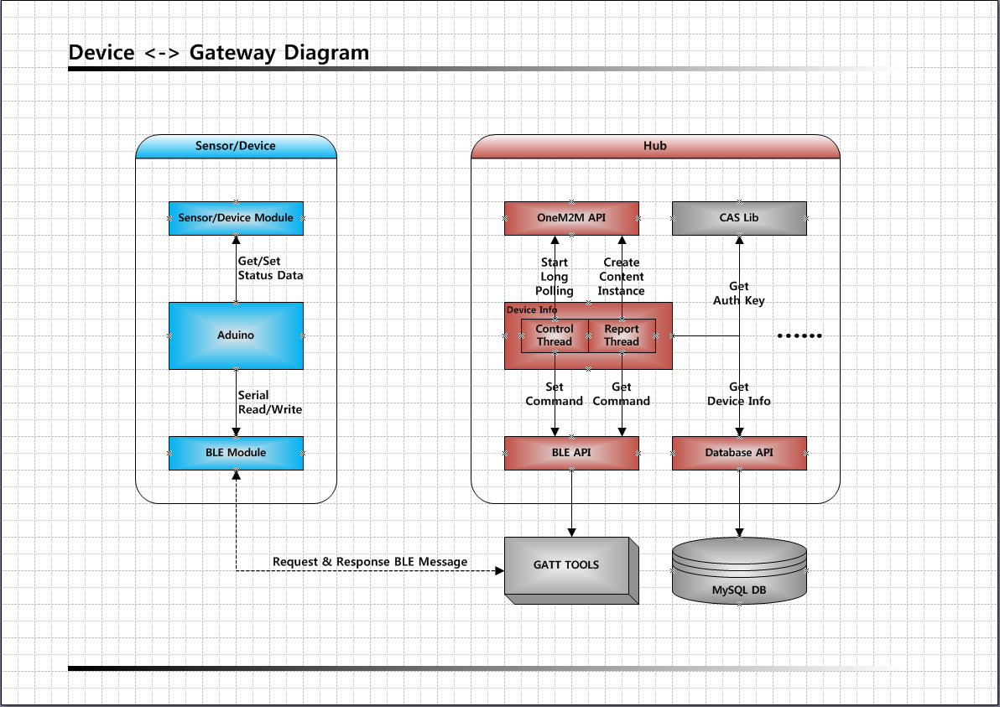

# Gateway Guide

Gateway를 사용하기 위한 설정과 명령등에 대해 설명한다.

## Gateway(Hub) 설명

Hub 프로그램은 기본적으로 Application 형태로 탑재된다. 
Platform 서버와는 HTTP 통신을 하며, 인증을 위해 CAS Lib.를 사용한다. 
Hub에 등록된 디바이스 목록들은 MySQL을 사용하여 관리하며, 
디바이스와는 GATT Tool를 이용해 BLE 통신을 한다. 
Bluetooth 초기화와 장치 검색은 HCI Tool를 사용한다. 
하기 그림은 Hub 기동중에 Hub와 Sensor/Device를 도식화한 것이다. 
 

 

## Config File 설명

Hub Program을 구동시키면 Config File을 읽어와서 설정한다. 
Config File 위치: “HUB_DIRECTORY”/config/grib.config 

Config File Item List 
ITEM											 | DESCRIPTION							 							| COMMENT
-------------------------- | ---------------------------------------| -----------------------
HUB_ID										 | Hub ID                              		| 
PLATFORM_SERVER_IP				 | One M2M 서버 IP 주소                   | 
PLATFORM_SERVER_PORT			 | One M2M 서버 Port 번호                 | 
AUTH_SERVER_IP						 | 인증 서버 IP 주소                      | 
AUTH_SERVER_PORT					 | 인증 서버 Port 번호                    | 
SDA_SERVER_IP							 | Semantic Discrptor 취득 서버 IP 주소   | 
SDA_SERVER_PORT						 | Semantic Discrptor 취득 서버 Port 번호 | 
MYSQL_DB_HOST							 | 디바이스 정보 DB 서버 IP 주소          | 
MYSQL_DB_PORT							 | 디바이스 정보 DB 서버 Port 번호        | 
MYSQL_DB_USER							 | 디바이스 정보 DB 서버 계정             | 
MYSQL_DB_PASSWORD					 | 디바이스 정보 DB 서버 비밀번호         | 
RESET_TIMER_USE						 | 자동 Reboot 기능 사용 여부             | 값: TRUE or FALSE
RESET_TIME_HOUR						 | 자동 Reboot 기능 시간                  | 값: 1~24
GRIB_DEBUG_ONEM2M					 | One M2M API Log 출력 여부              | 값: TRUE or FALSE
GRIB_DEBUG_BLE						 | BLE API Log 출력 여부                  | 값: TRUE or FALSE
GRIB_DEBUG_THREAD					 | 디바이스 Thread Log 출력 여부          | 값: TRUE or FALSE
GRIB_TOMBSTONE_BLE				 | BLE 에러 발생시 Log File 저장 여부     | 값: TRUE or FALSE
GRIB_TOMBSTONE_HTTP				 | HTTP 에러 발생시 Log File 저장 여부    | 값: TRUE or FALSE

 

## Hub 명령어 설명

Console 입력은 Program이 위치한 Directory에서 실행한다. 
Default Directory: /home/pi/20_GRIB_HUB/ 
 
./grib_hci init: BLE(HCI 인터페이스)를 초기화한다. 
./grib_hci scan: 주변 BLE 디바이스를 검색한다. 
./grib_hub regi "BLE ADDR": 해당 BLE 디바이스를 Hub에 등록한다. 
./grib_hub deregi "DEVICE ID": 해당 디바이스를 Hub에서 삭제한다. 
./grib_hub config: 현재 Config 정보를 출력한다. 
./grib_hub hub: Hub 프로그램을 실행한다. 

