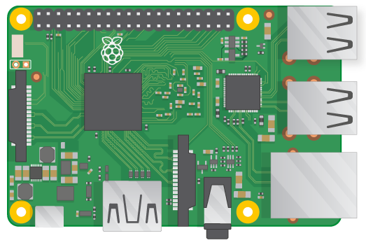
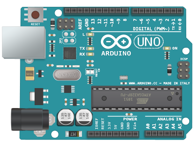
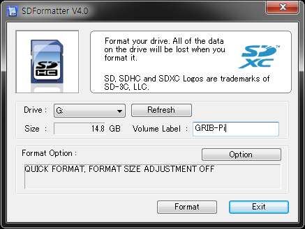
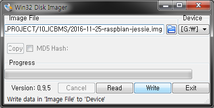

# Setup Guide

Gateway를 사용하기 위한 OS 설치 방법등에 대해 설명한다.

## Requirements
* Raspberry Pi3 Model B(+ SD Card)
* Aduino Uno(+CC2541 BLE Module)
* Raspbian 4.4.11-v7+
* Aduino IDE

 
※ Raspberry 공식 사이트: [https://www.raspberrypi.org](https://www.raspberrypi.org/)

 
※ Aduino 공식 사이트: [https://www.arduino.cc](https://www.arduino.cc/)

## Guide

- Raspbian OS 이미지를 Download한다. 
 Raspberry 공식 다운로드 사이트: [https://www.raspberrypi.org/downloads](https://www.raspberrypi.org/downloads/)
  

- 미리 준비한 SD Card를 Format한다. 
 사용 예) SDFormatter 

  

- 다운로드 받은 Raspbian OS 이미지를 Write한다. 
 사용 예) Win32DiskImager 

  

- ※ 그외 OS 설치에 관한 자세한 설명은 Raspberry 공식 Help 페이지 참조 
 Raspberry 공식 Help 사이트: [https://www.raspberrypi.org/help](https://www.raspberrypi.org/help/)
 